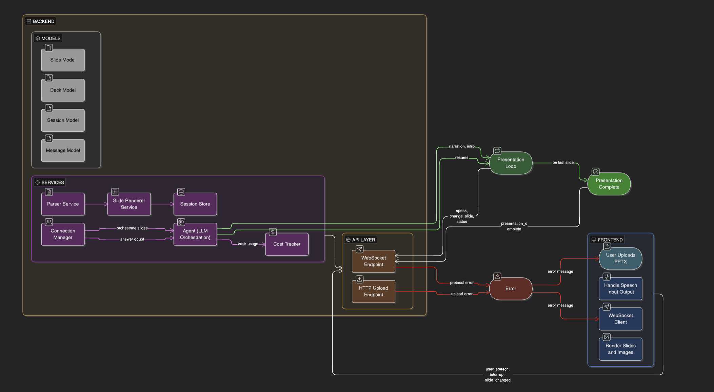

# PRESENTO Backend

Backend service for **PRESENTO - an AI presentation agent**.

This service handles deck ingestion, slide parsing, image rendering, and real-time AI presentation orchestration over WebSocket.

## What This Service Does

- Accepts `.pptx` uploads.
- Parses each slide into a normalized deck model (`title`, `subtitle`, `bullets`, `notes`).
- Converts slides into PNG images for frontend rendering.
- Runs the agent lifecycle:
  - introduction
  - slide-by-slide narration
  - user interruption and doubt handling
  - resume and completion signaling
- Tracks token usage and estimated API spend.

## Basic System Design

### System Design Diagram



### Core Components

- `main.py`: FastAPI startup, CORS setup, static file mount for slide images.
- `routes/upload.py`: upload validation, parsing flow, rendering trigger, session creation.
- `routes/websocket.py`: real-time protocol handler and presentation control loop.
- `services/agent.py`: prompt strategy, tool calling, and model response interpretation.
- `services/parser.py`: PowerPoint text extraction and cleanup.
- `services/slide_renderer.py`: conversion pipeline (`pptx -> pdf -> png`).
- `services/session_store.py`: in-memory session map.
- `services/conetion_manager.py`: per-connection state machine.
- `services/cost_tracker.py`: call-level and session-level cost accounting.

### Runtime Workflow

1. Client uploads `.pptx` to `POST /upload`.
2. Backend validates input, parses text content, and renders slide images.
3. Backend returns `session_id` and slide metadata.
4. Frontend connects to `/ws`, sends `load_deck`, then `start_presentation`.
5. Backend streams `change_slide`, `speak`, `status`, and completion events.
6. During interruptions, backend switches to doubt-answer mode and resumes from the saved slide.

## Prerequisites

### Python

- Python 3.10+ recommended

### System Tools (Required)

Install these on your machine before running the backend:

```bash
brew install --cask libreoffice   # pptx -> pdf
brew install poppler              # pdf -> png per page (pdftoppm)
```

`libreoffice` is required for conversion. `poppler` provides `pdftoppm`, which is preferred for reliable page-to-image output.

### API Key

Set `LLM_API_KEY` in your environment.

## Environment Configuration

```bash
cp .env.example .env
```

Expected variables:

```env
LLM_API_KEY="your-api-key-here"
CORS_ORIGINS=http://localhost:5173
```

## Installation

From `backend/`:

```bash
python3 -m venv .venv
source .venv/bin/activate
pip install -r requirements.txt
```

## Run the Server

From `backend/`:

```bash
uvicorn main:app --reload --host 0.0.0.0 --port 8000
```

Endpoints:
- `http://localhost:8000/`
- `http://localhost:8000/health`
- `http://localhost:8000/upload`
- `ws://localhost:8000/ws`
- `http://localhost:8000/slides/<session_id>/<index>.png`

## Operational Notes

- Sessions are in memory; restarting the backend clears active session context.
- Generated slide images are stored under `backend/static/slides/<session_id>/`.
- Ensure frontend `VITE_API_URL` and `VITE_WS_URL` target this backend instance.
